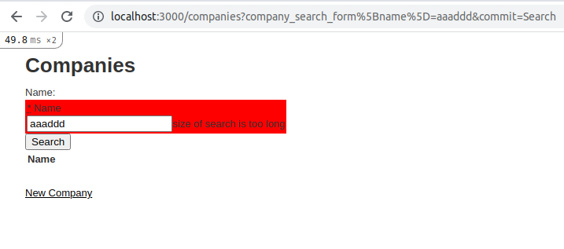

# README

This example demonstrates validations of ransach search form.

## To run example:

1. download it from github:
  ```bash
  mkdir ~ && git clone git@github.com:r72cccp/ransack-errors-example.git && cd ransack-errors-example
  ```
2. install and run migrations:
  ```bash
  bundle
  rails db:migrate
  ```

3. create something companies:
  ```bash
  RAILS_ENV=development bundle exec rails c
  ```

  ```bash
  Running via Spring preloader in process 170803
  Loading development environment (Rails 6.1.4.4)
  2.6.5 :001 > Company.create(name: 'aaa')
  2.6.5 :002 > Company.create(name: 'aaabbb')
  2.6.5 :003 > Company.create(name: 'ccceeefff')
  ```

4. run rails server:
  ```bash
  rails server
  ```

5. visit companies page:
  ```
  http://localhost:3000/companies
  ```

You would see the next:


The [CompanySearchForm](./app/forms/company_search_form.rb) validates only length. If searched string is greater than 5 symbols, you must see the error.
